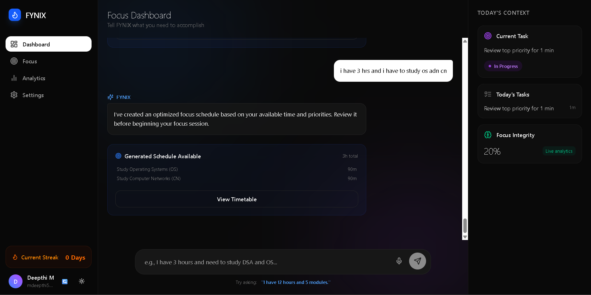
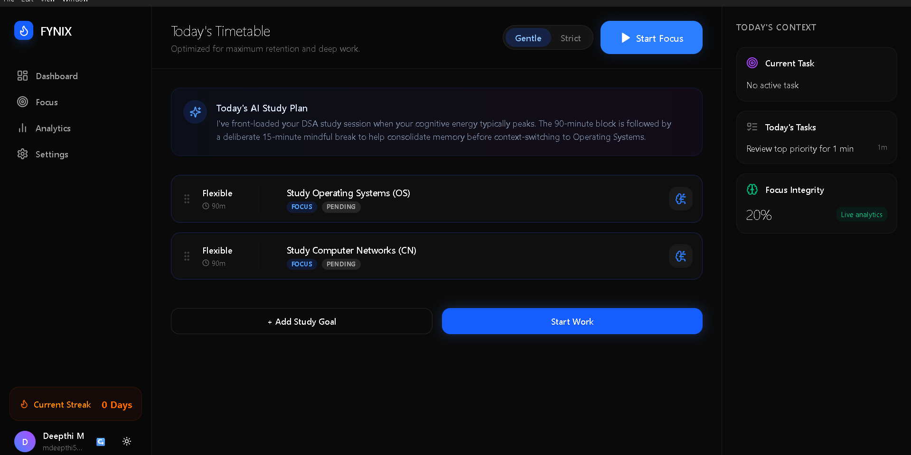
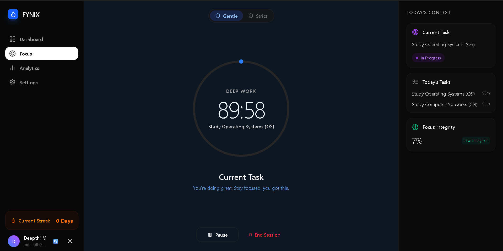
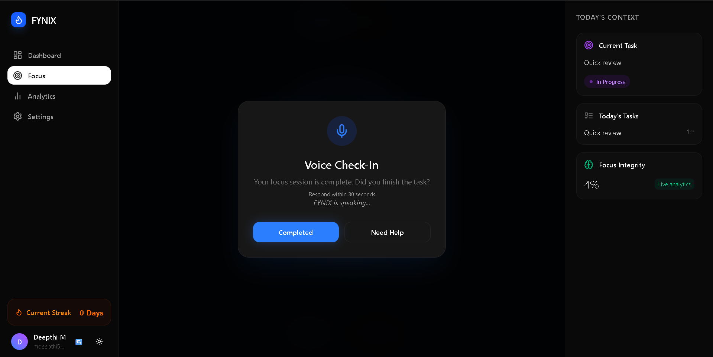
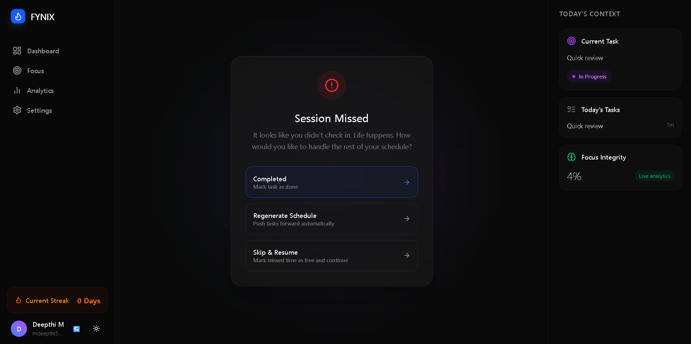
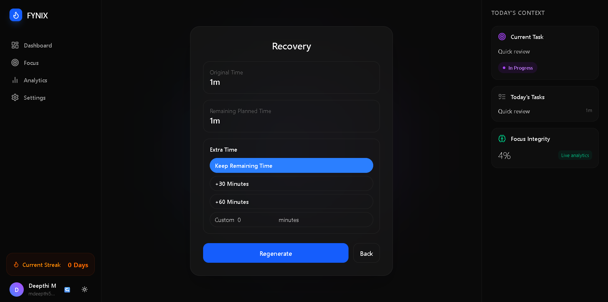
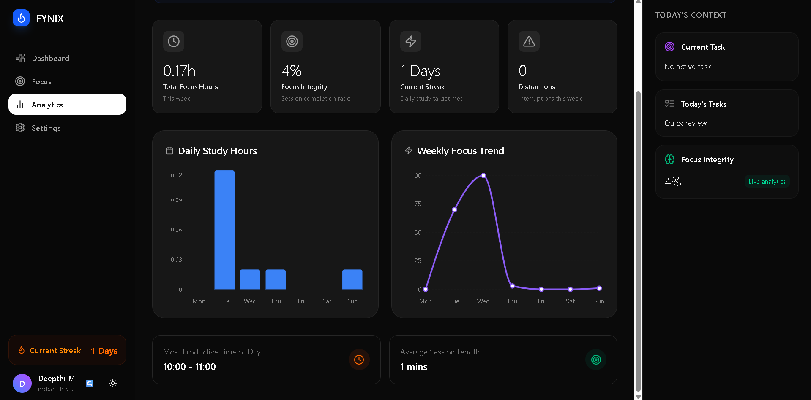
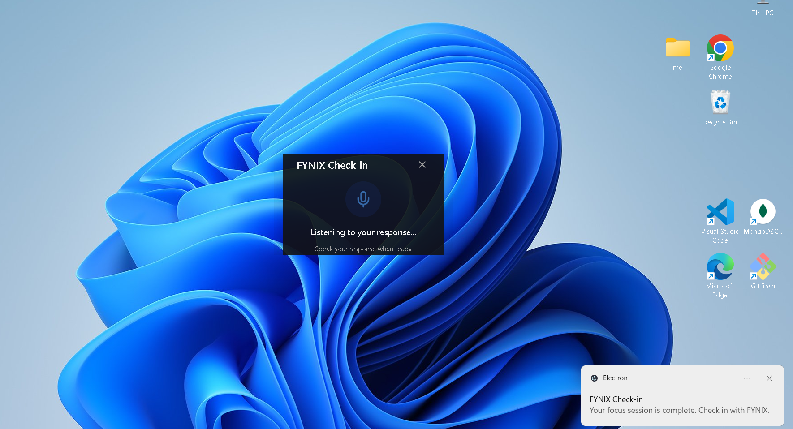

# 🧠 FYNIX

> **A desktop productivity companion designed to help users manage tasks, plan focused work, run structured focus sessions, track productivity, and interact through voice.**


---

---

## 📖 Overview

FYNIX is a full-stack desktop productivity application designed to help users plan focused work, manage tasks, run structured focus sessions, monitor productivity, and interact with the application through voice.

The application combines a modern Electron desktop client with a React interface, Node.js and Express backend, MongoDB persistence, Redis infrastructure, Socket.IO realtime communication, and a local Whisper-based voice service.

FYNIX is designed around the idea that productivity should be structured, measurable, and minimally distracting.

Whether users are planning their day, working through a focus session, reviewing productivity analytics, or responding to a voice check-in, FYNIX provides the complete workflow through a single desktop application.

---

## ✨ Features

### 🎯 Focus Management

- Start structured focus sessions
- Pause and resume sessions
- Complete focus sessions
- Track remaining session time
- Real-time session state
- Focus heartbeat tracking
- Focus integrity tracking
- Current-task tracking
- Automatic focus-session events

---

### 🔄 Session Recovery

FYNIX provides a recovery workflow when a planned focus session is missed or interrupted.

- Detect missed focus sessions
- Display session recovery options
- Preserve remaining planned time
- Add extra recovery time
- Support custom recovery duration
- Regenerate the schedule after recovery
- Continue the user's planned workflow
- Recover sessions without losing remaining task time

---


---

### 📋 Task Management

- Create and manage tasks
- Organize daily work
- Prioritize tasks
- Complete tasks
- Track active tasks
- Connect tasks with focus sessions

---


---

### 📅 Smart Scheduling

- Generate structured schedules
- Organize tasks into time blocks
- Plan focused work sessions
- Review daily schedules
- Persist schedule information

---


---

### 📊 Productivity Analytics

- Focus statistics
- Focus hours
- Productivity trends
- Streak tracking
- Focus integrity
- Session analytics
- Weekly productivity information
- Cached analytics responses

---


---

### 🔐 Authentication

- User registration
- User login
- JWT-based authentication
- Protected API routes
- Session validation
- Persistent authentication
- Logout support

Authentication persists across application restarts so users do not need to repeatedly sign in during normal use.

---


---

### ⚡ Redis Infrastructure

Redis is used to provide fast temporary and realtime infrastructure.

It supports:

- Analytics caching
- Distributed locks
- API rate limiting
- User presence
- Socket.IO pub/sub
- Temporary realtime state

MongoDB remains the persistent source of truth for application data.

---


---

### 🔄 Realtime Communication

FYNIX uses Socket.IO for realtime communication between the desktop application and backend.

Realtime functionality includes:

- Focus session events
- Heartbeats
- User presence
- Session recovery
- Focus completion
- Voice check-ins
- Overlay communication
- Realtime application updates

---


---

### 🎙️ Local Voice Interaction

FYNIX includes a local speech-processing pipeline.

```text
Microphone
    ↓
Electron
    ↓
Voice Upload
    ↓
Local FastAPI Service
    ↓
faster-whisper
    ↓
Speech-to-Text
    ↓
FYNIX
```

The voice service runs locally and is packaged with the Windows application using PyInstaller.

### 🔊 Native Text-to-Speech

FYNIX supports native speech output for voice interactions and focus check-ins.

- Native desktop text-to-speech
- Spoken focus check-ins
- Voice feedback during focus sessions


### 🖥️ Desktop Application

The complete FYNIX experience is provided through Electron.

- Dashboard
- Focus interface
- Analytics
- Settings
- Voice overlay
- Notifications
- Voice interaction
- Native text-to-speech
- Windows installer

## 🏗️ Architecture

The following diagram illustrates how FYNIX connects the Electron desktop application with the Node.js backend, MongoDB, Redis, Socket.IO, and the local Whisper voice service.


## 📸 Screenshots

### 🏠 Dashboard

The main dashboard provides an overview of tasks, current focus state, and productivity information.



---

### 📅 Timetable

The Timetable provides a structured view of planned tasks and scheduled focus blocks throughout the day.



---

### 🎯 Focus Session

The Focus Session interface provides a structured environment for completing the current task while tracking session progress.



---

### 🎙️ Voice Check-In

FYNIX provides voice-based focus check-ins during active sessions, allowing users to respond without leaving their workflow.



---

### ⚠️ Session Missed

When a scheduled focus session is missed, FYNIX provides recovery options for handling the remaining schedule.



---

### 🔄 Session Recovery

The Recovery interface allows users to adjust the remaining planned time and regenerate their schedule after a missed session.



---

### 📊 Analytics

Analytics provides productivity statistics, focus hours, trends, streaks, and focus integrity information.



---

### 🎙️ Voice Overlay

The voice overlay provides realtime focus check-ins while FYNIX is running in the background.




## 🛠️ Tech Stack

- Electron
- React
- Vite
- Node.js
- Express
- Socket.IO
- JWT
- Mongoose
- MongoDB
- Redis
- Docker
- Python
- FastAPI
- faster-whisper
- CTranslate2
- PyInstaller
- electron-builder
- NSIs


## 📦 Download FYNIX

The latest Windows installer is available from the project's GitHub Releases page.

- Windows

Download:

```bash
FYNIX Setup 1.0.0.exe
```

The installer provides the FYNIX Windows desktop application and its packaged local voice service.

The unpacked build inside release/win-unpacked/ is intended primarily for local testing and is not required for normal users.


## 🚀 Getting Started

This section is for developers who want to clone the project, run FYNIX locally, and modify the source code.

### 1. Clone the Repository
```bash
git clone https://github.com/Deepthi-M555/Focus-Companion-.git
cd Focus-Companion-
```
### 2. Install Dependencies

Install root dependencies:

```bash
npm install
```

Install backend dependencies:

```bash
cd server
npm install
cd ..
```

Install client dependencies:

```bash
cd client
npm install
cd ..
```
### 3. Configure Environment Variables

Create:

```bash
server/.env
```

Example:

```bash
MONGO_URI=your_mongodb_connection
JWT_SECRET=your_jwt_secret
```

```bash
OPENROUTER_API_KEY=your_api_key
OPENROUTER_MODEL=your_model
```

```bash
VOICE_SERVICE_URL=http://127.0.0.1:8001
REDIS_URL=redis://127.0.0.1:6379
```

Never commit real API keys, database credentials, JWT secrets, or environment files.

### 4. Start Redis

If the Redis container already exists:

```bash
docker start fynix-redis
```

Verify Redis:

```bash
docker exec -it fynix-redis redis-cli ping
```

Expected:

```bash
PONG
```

If Redis has not been created:

```bash
docker run -d --name fynix-redis -p 6379:6379 redis:7-alpine
```
### 5. Start the Backend
```bash
cd server
npm run dev
```

The development backend runs on:

```bash
http://localhost:5000
```
### 6. Start FYNIX

Open another terminal from the project root:

```bash
npm run electron
```

Electron launches the FYNIX desktop application.

### 7. Voice Service

The development voice service runs locally on:

```bash
http://127.0.0.1:8001
```

Health endpoint:

```bash
http://127.0.0.1:8001/health
```

The packaged Windows application automatically starts its bundled voice service.


## 💡 Usage
- Launch FYNIX.
- Login or create an account.
- Review tasks on the Dashboard.
- Create or review your schedule.
- Start a Focus session.
- Work on the current task.
- Minimize FYNIX when required.
- Respond to voice check-ins.
- Complete the focus session.
- Review productivity information in Analytics.
- Reopen FYNIX later without unnecessarily signing in again.

## 📦 Build a Windows Release

From the project root:

```bash
npm run dist
```

The build process performs:

```text
React production build
        ↓
Electron packaging
        ↓
Voice-service packaging
        ↓
Windows NSIS installer

```
The generated installer is placed inside:

```bash
release/
```

For normal users, distribute:

```bash
FYNIX Setup 1.0.0.exe
```

Do not distribute:

```bash
release/win-unpacked/
```

## 🧪 End-to-End Testing

Before publishing a release, verify the complete application flow:

1. Close current FYNIX
1. Run FYNIX Setup
1. Install
1. Launch installed FYNIX
1. Login
1. Verify Dashboard
1. Start Focus
1. Minimize / background
1. Wait for voice overlay
1. Speak
1. Verify transcript
1. Complete focus session
1. Test no-response → snooze
1. Open Analytics
1. Close FYNIX
1. Reopen FYNIX
1. Confirm still logged in

## ⚠️ Limitations
Windows is currently the primary supported desktop platform.
The packaged Whisper model increases the application size.
Voice processing depends on the local packaged voice service.
AI functionality depends on the configured external AI provider and its usage limits.
Online functionality depends on the deployed backend and database infrastructure.
Automatic desktop updates are not currently included.


## 🚀 Future Improvements

Planned improvements for FYNIX include:

- Automatic desktop updates
- Improved offline support
- More configurable focus and recovery workflows
- Enhanced voice interaction
- Advanced productivity insights
- Automated end-to-end testing
- CI/CD-based release automation
- Secure refresh-token authentication


## 🤝 Contributing

Contributions, suggestions, bug reports, and feature requests are welcome.

Feel free to fork the repository and submit a pull request.

### Contributing Workflow

If you want to contribute code to FYNIX:

- Fork the repository on GitHub.
- Clone your fork.
- Follow the Getting Started section above to configure the project.
- Create a feature branch.
- Make your changes.
- Test your changes.
- Commit your changes.
- Push your branch.
Open a Pull Request.

Create a feature branch:

```bash
git checkout -b feature/your-feature
```

Check your changes:

```bash
git status
git diff --stat
```

Commit your changes:

```bash
git add .
git commit -m "feat: describe your change"
```

Push your branch:

```bash
git push origin feature/your-feature
```

Then open a Pull Request on GitHub.

Please do not commit:

```bash
.env
client/.env
server/.env
voice-service/.env
```

```bash
node_modules/
venv/
```

```bash
voice-service/models/
```

```bash
client/dist/
dist/
build/
release/
```

```bash
API keys
JWT secrets
Database credentials
```

Contributors normally submit Pull Requests. Publishing an official FYNIX GitHub Release is a maintainer/release-owner responsibility.


## 📄 License

This project is licensed under the MIT License.

See the LICENSE file for details.


## 👩‍💻 Author

Deepthi M

GitHub: https://github.com/Deepthi-M555

Creator, Developer & Maintainer of FYNIX.

Feel free to connect, raise issues, suggest improvements, or contribute to the project.
